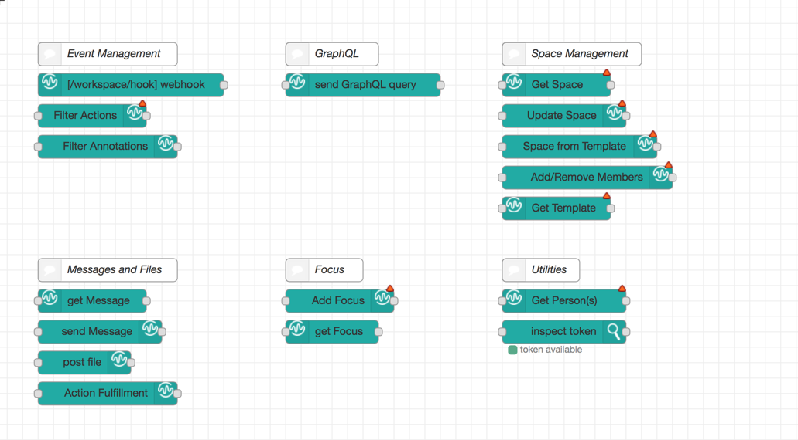

node-red-contrib-wws
=====================

A set of node-red nodes to interact with [IBM Watson Workspace](https://workspace.ibm.com/).

# Purpose
This node is intended to be used for communicating with Watson Workspace APIs using [Workspace Apps](https://developer.watsonwork.ibm.com/docs/get-started/what-can-you-build). Once you have created a Workspace App, you can configure the corresponding account within node-red representing this app.
Now you have the ability to configure webhooks and send messages or files to spacesto which the App belongs to.

# Installation

## Prerequisites
The following packages are required to be present in node-red prior to this installation
* `"body-parser": "^1.18.2"`
* `"simple-oauth2": "^1.5.2"`
* `"javascript-state-machine":"^3.0.1"`
* `"follow-redirects":"^1.3.0"`

## Manual Installation
* In case of manual installation copy the code to the user directory of Node-RED e.g. `/data/node_modules/node-red-contrib-wws`.
* Install the dependencies via npm install and move packages one level up `mv node_modules/* ..´.
* To make Node-RED find the code, define the NODE_PATH environment variable by adding the Node-RED installation directory first, and the user directory second. Here is an example: `NODE_PATH="/usr/src/node-red/node_modules:/data/node_modules"`

# Features
* credentials node
  * creates a configuration node for a dedicated Watson Work Application, 
  * containing App ID and App Secret, 
  * plus additional OAuth configuration elements
* webhook node
  * Configure the webhook url
  * converts events into node-red friendly messages
  * shows incoming events on nodes status
* message node
  * send messages to a space
  * provides a configuration interface (including preview functionality)
  * selection of available spaces
  * availability to upload a profile photo for each app
  * automatically authenticates the app using the 'Authenticate as App' flow
  * returns response from WWS to msg.payload
* file node
  * automatically authenticates the app using the 'Authenticate as App' flow
  * selection of available spaces
  * optional usage of a different access token (e.g. from 'Authenticate on behalf of a user')
  * either sends a file (of any kind) or an image (png, jpeg or gif) to a space
* graphQL node
  * static or dynamic GraphQL query 
  * automatically authenticates the app using the 'Authenticate as App' flow
  * optional usage of a different access token (e.g. from 'Authenticate on behalf of a user')
  * return node-red friendly results.
   
# Known Issues
* There is an issue with the additional input parameter `operationName` or `variables`. The best workaround is to ignore those additional parameters and stick to the pure graphQL query parameter.