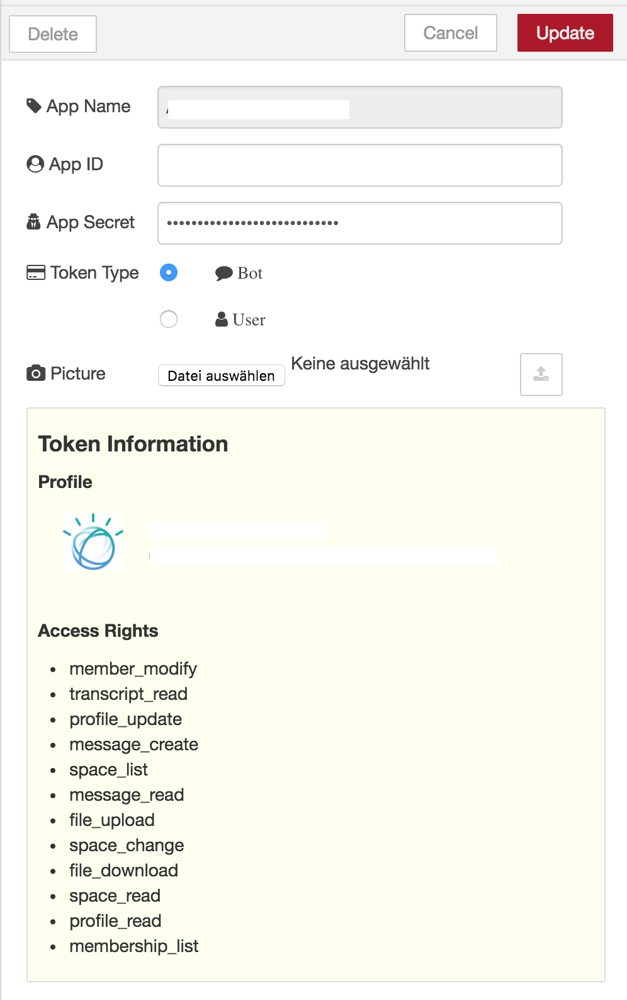
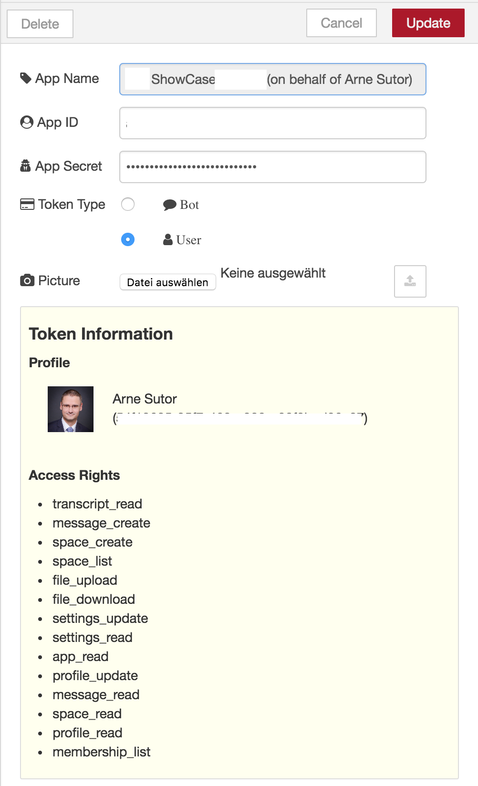
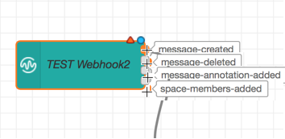
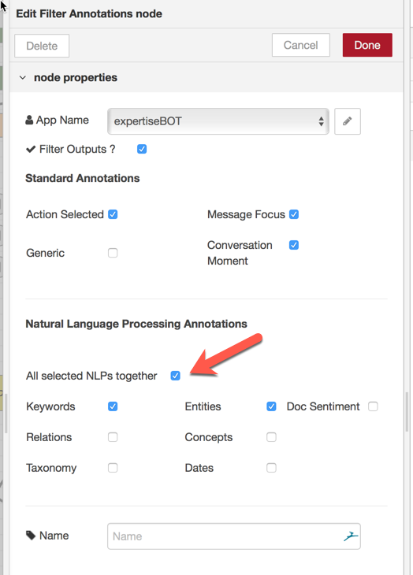
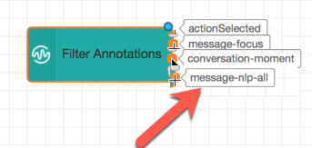
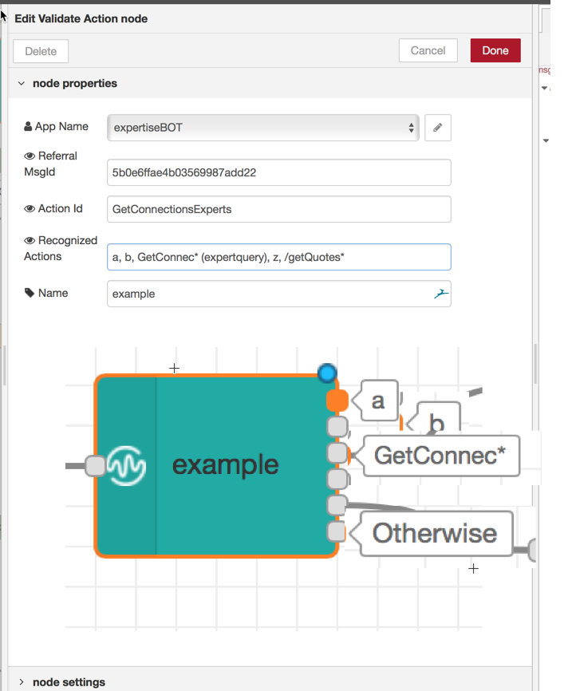
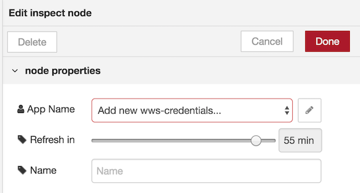

node-red-contrib-wws
=====================

A set of node-red nodes to interact with [IBM Watson Workspace](https://workspace.ibm.com/).

# *Purpose*
This set of nodes is intended to be used for communicating with the Watson Workspace APIs using [Workspace Apps](https://developer.watsonwork.ibm.com/docs/get-started/what-can-you-build). 

Once you have created a Workspace App, you can create the corresponding "NodeRed Configuration node" representing this app.
With these nodes, you have the ability to configure webhooks, to send messages or files to spaces to which the corresponding Workspace App is attached, to execute [graphQL commands](https://developer.watsonwork.ibm.com/docs/developers-guide/graphql-api), to create and update spaces based on Templates, to get information about the Focus assigned to a given message and to add custom Focus, to filter "ActionSelected" annotations and Webhook events.

You can also configure a [Workspace Apps](https://developer.watsonwork.ibm.com/docs/get-started/what-can-you-build) to **Authorize as a User**.

Here is the list of Nodes currently proposed by this package.

Full documentation, including sample NodeRed flows using these nodes, is available in the Documentation Directory of the [corresponding Github repository](https://github.com/stefanopog/node-red-contrib-wws/tree/master/docs)

# *Changes*
## Changes in V2.0.5
* The **Send Message** node has been modified to get new input attributes. It is also, now, possible to enter the payload from the Configuration Panel of the node
* The **Filter Annotations** node has been fixed to avoid raising errors when not necessary
* The **Webhook** node has been modified in what relates to the _space-updated_ event. The output information (_payload_) has been modified
* The **Action Fulfillment** node now supports an additional input to programmatically define if the node accespts _Annotations_ or _Attachments_. A missing _buttons_ array inside _AFElements_ is also supported. 
* All the nodes have been revisited to avoid declaring mandatory attributes when those attributes may be provided by the input **msg object** 

## Changes in V2.0.0
* Authorize as User 
* The **Inspect** Node has been introduced
* The **Get Spaces** node now also supports the **Get My Spaces** function
* The **Get Person(s)** node now also supports the **Get Me** function
* All nodes support an incoming **msg.wwsToken** attribute which allows you, if present, to overwrite the authentication performed by the Credentials node

# *Package Details*
## Credentials node
  * creates a configuration node for a dedicated Watson Work Application, 
  * It holds the App ID and App Secret, 
  * pulls Application name from Watson Work,
  * pulls additional OAuth configuration elements
  * availability to upload a profile photo for each application
  * Note : **this node is used by all the other nodes**
  * Note : **You can upload a new picture for the BOT and/or the User using this node**
  * Note : **This nodes supports now BOTH Authorization as app AND Authorize as user**

### Authorization as app

### Authorize as user

## Webhook node
  * Configure the webhook url
  * converts events into node-red friendly messages
  * shows incoming events on nodes status
  * attaches details of the *original message* for **Annotations** and **Reactions**
  * optionally provides filtering of outputs according to the **event type** received by the webhook

  

## Send message node
  * send messages to a space
  * provides a configuration interface (including preview functionality)
  * selection of available spaces
  * returns response from WWS to msg.payload

## Get message node
  * Gets all the information from a given message, including **Annotations** and **Reactions**

## File node
  * either sends a file (of any kind) or an image (png, jpeg or gif) to a space
  * selection of available spaces

## GraphQL node
  * static or dynamic GraphQL query 
  * return node-red friendly results.
  * supports **BETA** and **EXPERIMENTAL** APIs

## Filter Annotations
  * This node provides a convenience to separate Annotations (coming from the **Webhook** node) in order to assign different processing to each Annotation Type
  * It provides a convenience to select a subset of NLP annotations

## Filter Actions node
  * this is a service node which makes it easy to filter Annotations coresponding to **actionSelected** lenses
  * you can specify multiple **ActionId** (they can come from *custom intents*, from *slash commands*, from *buttons* etc)
  * provides multiple outputs. Each output corresponds to one of the possible **actionId** that the instance of the node supports

## Get (Templated) Space node
  * this node simply retrieves all the information related to a standard space or to one that was built out of a Template
  * It friendly provides textual representation of **preperties**, **property values** and **status**

## Update Space
  * This node provides a tool to easily update a Space coming from a Template. It allows to easily change the **status** and any of the **properties**.
  * The main characteristics of this node is that the **names** and the **values** of the **properties** and of the **status** are entered using their textual representation.
    * New Property values are specified using a comma-separated string where each item is in the form of a *name = value* pair

## Space From Template
  * This node provides a tool to easily create a Space from a Template. It allows to easily initialize any of the **properties** coming from the Template and the **initial members**.
  * The main characteristics of this node is that the **names** and the **values** of the **properties** are entered using their textual representation.
    * New Property values are specified using a comma-separated string where each item is in the form of a *name = value* pair
  * This node **ONLY WORKS WITH an AUTHORIZE-AS-USER**

## Get Template
  * This node provides a tool to easily retrieve all the informations from a Template.
  * This node **ONLY WORKS WITH an AUTHORIZE-AS-USER**

## Add/Remove Members
  * This node provides a tool to easily add or remove Members to or from a Space. More than one member can be added or removed at the same time.

## Get Person(s)
  * This node provides a tool to easily retrieve all the details for a set of people.
  * The set of people can be specified as a set of comma separated **email addresses** or "**IDs**"
  * It can retrieve information **about Me**, i.e. the identity under which the node is executed.

## Get Focus
  * This node provides a tool to easily invoke the **Focus API** to retrieve inforrmations about the Focuses that the system assigned to a given message.

## Add Focus
  * This nodes provides a tool to easily add a new, custom Focus to an existing message

## Action Fulfillment
  * The node provides a convenience tool for creating Action Fulfillment **Attachments** and **Annotations** and to execute the relevat GraphQL mutation.
  * It works in conjunction with information that are passed by the previously described **Webhook** node.

## Inspect Token
  * The node inspects the token used to access <a href="https://workspace.ibm.com">IBM Watson Workspace</a> and displays its status as node status message.
  * In case the token is used as <code>Authorize on behalf of a user</code> this node can be used to automatically refresh the token after a user provides a refresh period.
  
   
# Known Issues
* Any node returning collections (**_items_**) does **not provide yet** a mean tp walk through the collection using the iterator. This will be fixed in a next version
  
# *Installation*

## Automatic Installation
This packages installs using the standard **Manage Palette** feature in the NodeRed interface.

### Prerequisites
The following packages are required to be present in node-red prior to this installation
* `"body-parser": "^1.18.2"`
* `"simple-oauth2": "^1.5.2"`
* `"follow-redirects":"^1.3.0"`
* `"request-promise-native": "^1.0.5"`
* `"request": "^2.87.0"`
* `"crypto": "^1.0.1"`

## Manual Installation
* In case of manual installation copy the code to the user directory of Node-RED e.g. `/data/node_modules/node-red-contrib-wws`.
* Install the dependencies via npm install and move packages one level up `mv node_modules/* ..´.
* To make Node-RED find the code, define the NODE_PATH environment variable by adding the Node-RED installation directory first, and the user directory second. Here is an example: `NODE_PATH="/usr/src/node-red/node_modules:/data/node_modules"`
